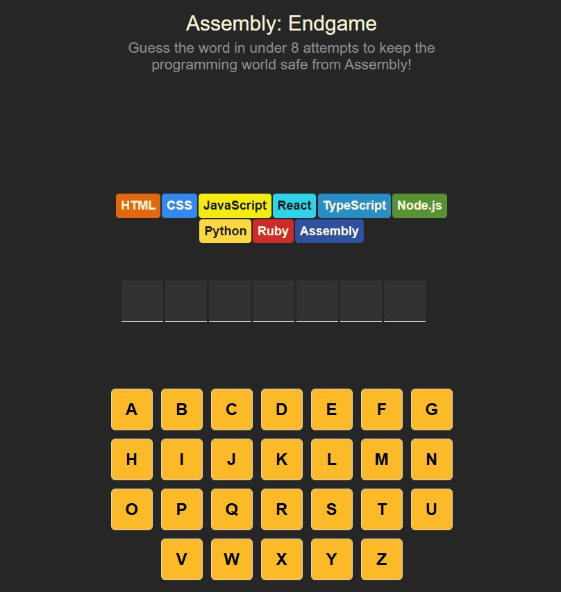

# Assembly: Endgame 🎮

A twist on the classic Hangman game, built with React. Instead of a stick figure, each wrong guess "kills off" a programming language — guess wrong 8 times and it's game over for the programming world!



## About

Guess the secret word one letter at a time before you run out of attempts. Each incorrect guess eliminates one of the 8 programming languages shown on screen. Guess the whole word before they're all gone to win (and get a confetti celebration 🎉).

## Features

- Interactive on-screen keyboard with correct/incorrect letter states
- Visual "language elimination" mechanic in place of a traditional hangman drawing
- Farewell messages for each language as it's eliminated
- Win/lose detection with a dedicated game status banner
- Confetti animation on a win (`react-confetti`)
- Screen-reader-friendly live status updates (`aria-live` regions) for accessibility
- "New Game" button to reset and play again with a new random word

## Tech Stack

- [React](https://react.dev/) (hooks: `useState`)
- [Vite](https://vitejs.dev/) — dev server & build tool
- [nanoid](https://github.com/ai/nanoid) — unique key generation
- [clsx](https://github.com/lukeed/clsx) — conditional class names
- [react-confetti](https://github.com/alampros/react-confetti) — win celebration effect

## Getting Started

### Prerequisites

- [Node.js](https://nodejs.org/) (v16 or later recommended)
- npm

### Installation

```bash
# Clone the repository
git clone https://github.com/ziadTarek30/hangman.git
cd hangman

# Install dependencies
npm install

# Start the development server
npm run dev
```

Then open the local URL shown in your terminal (typically `http://localhost:5173`) in your browser.

### Build for production

```bash
npm run build
```

## How to Play

1. A random word is selected automatically when the game loads.
2. Click letters on the on-screen keyboard to guess.
3. Correct guesses reveal the letter in the word; incorrect guesses eliminate a language.
4. Guess the full word before all 8 languages are eliminated to win.
5. Click **New Game** to reset and play again.
